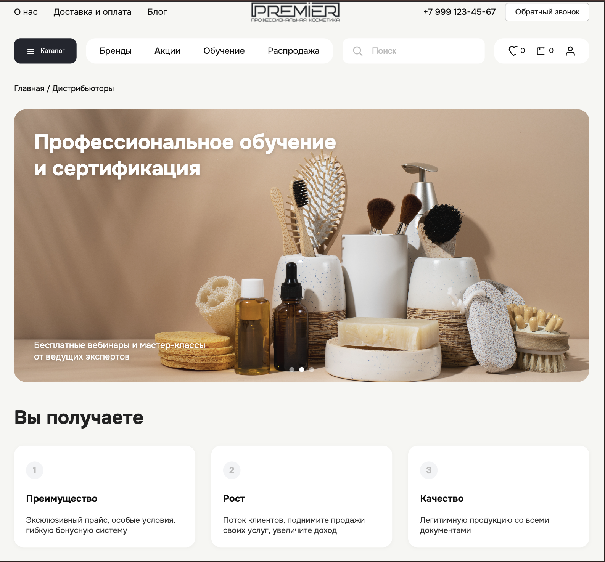

# Адаптивная верстка сайта Premier

Проект представляет собой адаптивную верстку сайта для планшетов (640px) и мобильных устройств (320px).


### Скриншот 1



## Установка

```bash
# Клонируем репозиторий
git clone https://github.com/username/repo.git

# Переходим в директорию проекта
cd repo

# Устанавливаем зависимости
npm install
```

## Запуск

```bash
npm start
```

## Технологии

- HTML5
- CSS 
- JavaScript

